# Container Profiler
Updated version of Container Profiler

University of Washington Tacoma

# Table of Contents
   * [MANUAL](#manual)
     * [Container Profiler](#container-profiler-1)
         * [General Information](#general-information)
         * [Overview](#overview)
     * [Tutorial - Profiling a Container](#tutorial-profiling-a-container)
       * [Video Demonstration](#video-demonstration)
       * [Install the Container Profiler](#install-the-container-profiler)
       * [Using the Container Profiler](#using-the-container-profiler)
     * [Metrics Description](#metrics-description)
       * [VM Level Metrics](#vm-level-metrics)
       * [Container Level Metrics](#container-level-metrics)
       * [Process Level Metrics](#process-level-metrics)

   * [FAQ](#faq)
      * [General](#general)
          * [Why should I use the Container Profiler?](#why-should-i-use-the-Container-Profiler)
      * [Usage](#usage)
          * [How do I use Container Profiler on my own container?](#how-do-i-use-the-Container-Profiler-on-my-own-container)
      * [Miscellaneous](#miscellaneous)
          * [How should I reference the Container Profiler if I use it?](#how-should-i-reference-the-Container-Profiler-if-i-use-it)
          


# MANUAL
___
___

## Container Profiler
___
The Container Profiler can be used as a tool to profile an application or workflow by taking interval snapshots of a collection of linux resource utilization metrics throughout the course of the job. These snapshots are then stored as JSON data which can then be plotted and used to see how the metrics changed once the job is finished.

**Authors:** Wes Lloyd & Huazeng Deng & Ling-hong Hung & David Perez & Varik Hoang & Tanmay Shah

**Version:**   0.4

**GitHub:**    https://github.com/tanmayuw/ContainerProfiler

**License:**   Copyright.

___
## General Information
___
In order to use the Container Profiler, a containerized application/workflow/script to be run and profiled is needed.
A custom docker image of the Container Profiler can be created using the build scripts which can be run to benchmark the
custom application/workflow/script.

ContainerProfiler includes scripts **rudataall.sh** and **rudataall-psutil.py** to profile the resource utilization on VM level, container level and process level. 
visual guidance on usage of the profiler script can be found in the YouTube video linked below.


## Overview
___

The Container profiler repository is organized in the following structure:  

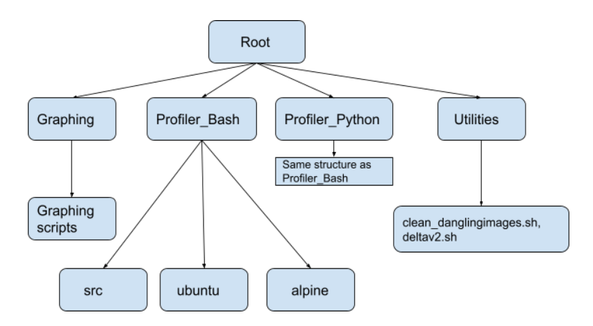

There are two versions of the profiler - Bash and Python, each with an Alpine and a Ubuntu environment. Each of the Profiler versions have three folders. The src folder contains the files common between the ubuntu and alpine directories (and environments).

As seen in the diagram above, the root directory has four folders of importance: **Graphing, Profiler_Bash, Profiler_Python** and **utilities.** 
The Profiler_Bash and Profiler_Python house the alpine and ubuntu environments of the Bash and Python versions of Container Profiler respectively. 
Under each of the Profiler_Bash and Profiler_Python,  there are three folders:
* **src** : which houses the common files between the ubuntu and alpine environment releases
* **alpine** : which houses the scripts pertaining to the alpine release of the bash or python version of the profiler, depending on the parent directory.
* **ubuntu** : which houses the scripts pertaining to the ubuntu release of the bash or python version of the profiler, depending on the parent directory.

The ‘src’ folder has two files - the **entrypoint.sh** (**profiler** for python version but different contents), 
and the **rudataall.sh** (**rudataall-psutil.py** in python version). The entrypoint.sh file is the first file to execute when the docker container is invoked. It is responsible for executing the specified command and collecting samples at specified time delta. The rudataall.sh file (rudataall-psutil.py in python version) is the worker file which collects a sample when invoked. It is invoked by entrypoint.sh file at required intervals to collect the samples.

The *< environment >* folders (environment can be ubuntu or alpine) contain the following files:
* **Dockerfile**: This file is required to build the needed docker image from source. Users can modify this file and add dependencies they require in the image using the RUN commands.
* **build.cfg**: This file allows settings three parameters:
  * CHECK_ONLINE_RESPONSE (“y”/”n”) : which allows users to set whether they want to pull image from docker hub
  * ONLINE_IMAGE : which is the tag of the image the user intends to pull from docker hub (not required when building from source)
  * BUILD_IMAGE_TAG : which is the tag of the image the user wants to put on the image built from source.
* **run_commands.sh**: This file is where the user can put the commands to execute. It gets copied in the image and is executed depending on the COMMAND parameter set in the run.cfg file. Note that to execute a new set of commands in this file, you have to build the image again.
* **build< environment >< version >sampler.sh**:  This file is the executable which does the build process using the Dockerfile and the specified parameters build.cfg. It tags the image built from source with the specified tag.
* **run.cfg**: This file allows the user to specify the parameters needed to control the container functioning on run. Users have the ability to provide the parameters of delta between the sample collection, the command to execute, the output directory on the host machine to volume map the collected data, the tag of the image to use to create the container, the level of verbosity and the directory in the container to store the collected data to be mapped with the output directory on the host machine.
  * COMMAND: These are the commands to be benchmarked. You can provide one line commands as arguments to this parameter. If you have a fixed set of commands to execute, it is the best idea to write them in the run_commands.sh file, build the image, and pass ` bash run_commands.sh` as the value to this parameter.
  * DELTA: This parameter takes as input the delta time interval for collecting samples. This value should be provided in milliseconds when using the bash version and in seconds when using the python version. If DELTA is set to 0, it will only collect two samples - one before and one after the task is completed.
  * OUTDIR:  This is the output directory you want the collected samples to be stored in on the host machine, and is default set to ‘newjson’.
  * RUN_IMAGE_TAG: This is the tag of the image you wish to use to build the container and execute the commands to benchmark
  * VERBOSITY: This is the level of detail in verbosity of VM, Container and Process levels of data you need in the collected data. It can be specified by individual flags (as “-v -p -c” or “-v -c” ) in the bash version and they can be collectively passed in a single flag (as “-vpc” or “-vc” ) in the python versions of the profiler.
  * The PROFILER_OUTPUT_DIRECTORY: This is the directory in the container which is volume mapped with the output directory on the host machine and stores the collected samples.

  * **run< environment >< version >sampler.sh** : This file is the executable which executes the run process - including the creation of container, execution of commands to benchmark in the container, collection of data with given verbosity and saving the output in the specified directory.

The **Graphing** directory is used to graph the output generated by the profilers in Profiler_Bash and Profiler_Python. 
It takes in as input, a folder of json samples collected, takes the deltas, turns them to csv files and then plots them.
The output is stored in the vm_container_images folder. A test output file `newjson_test` is provided in the root directory, 
which can be used to test graphing scripts using `python3 graph_all.py -f ../newjson_test` command. 
___
### Utilities Reference
___
### deltav2.sh
___
**deltav2.sh** calculates the delta from 2 json files produced by **rudataall.sh**

It writes the deltas to stdout in json format and the missing fields to stderr

#### Usage:
```bash
deltav2.sh file1.json file2.json 2>missing.txt 1>delta.json
```
Test file and scripts are found in testFiles

#### Description
Basically it loops through file1 to find key : numeric_value pairs and store them in an associative array. It then loops through file2 to print out the json elements and calculate deltas. Missing values in file1 are printed here and a second key numericValue associative array is mad. A third loop then searches through the first associative array to fine missing values in file2. 

As long as there is no more than one key : value pair per line in the json files and the key is unique (i.e. doesn't depend on the structure of the higher order json objects), the script should work fine. It is tolerant of order permutations, new or different fields, and missing lines but depends on file2 being valid json.
___
### clean_dangling_images.sh
___
**clean_dangling_images.sh** script is useful for cleaning the now dangling images which are not associated with any containers to free memory.

#### Usage
```bash
sudo bash clean_dangling_images.sh
```
#### Description
This script finds all docker images not associated with any containers and tagged with a `<none>` tag.
It shows the image IDs to the user and allows the user to remove them. 


# Tutorial: Profiling a Container

## Video Demonstration
**Video:**     https://youtu.be/HzuDeuPpE1g

## Install the Container Profiler
```bash
git clone https://github.com/tanmayuw/ContainerProfiler.git
```

## Using the Container Profiler

In this tutorial and in general usage, all docker related commands need to be executed with root privileges. 
It is recommended that you use Container Profiler with root privileges. You can enter superuser mode by `sudo su` command.  

Navigate to /< Profiler version >/< environment >/ directory according to your preferred version and environment. 

For this tutorial, I am using the Alpine Python version: 

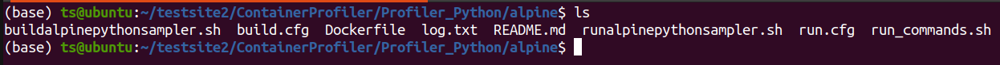

1) By specifying the parameters in `build.cfg` file, you can choose to either build your custom image from source
   or to pull an already built vanilla image from dockerhub which you can modify, commit and run using the run< environment >< version >sampler.sh scripts.
   In this tutorial, I am building this image from source.

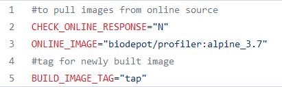

2) Next, open the `Dockerfile` to specify the packages to be installed for your custom container. 
    I am currently testing the Alpine Python version with `stress-ng` package, and so I added the 
    RUN commands in dockerfile to install it on my container. In a similar manner, you can add your 
    own required packages and change the environment/OS version. DO NOT CHANGE ANYTHING ELSE.

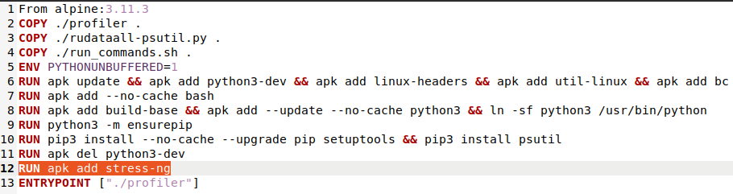

3) If you have a specific set of commands to execute in the custom container, you can put them in the run_commands.sh file.
   
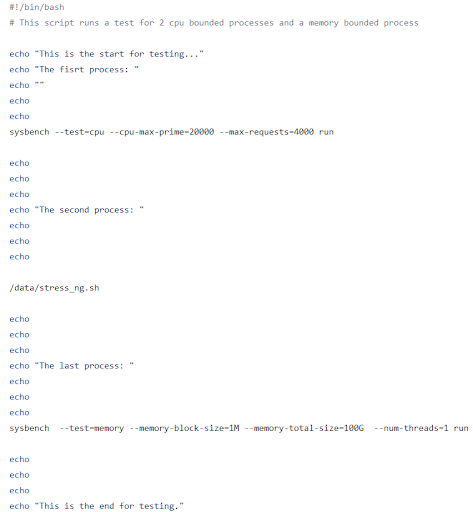

In this tutorial, I will only be testing a single command which I can input later in run.cfg file.

4) Build the image with `sudo bash build<environment><version>sampler.sh` command.

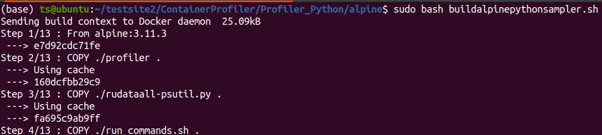

5) Next, you can modify the `run.cfg` file to provide runtime parameters: 

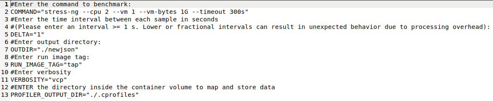

6) Now, you can execute `sudo bash run<environment><version>sampler.sh` to run the built container. 
 Make sure that the RUN_IMAGE_TAG is set to the tag of the image you built and want to run. Don't worry if you see an 
   error like `cat: /sys/fs/cgroup/blkio/blkio.sectors` as that metric is no longer maintained in newer versions of Linux kernel. 

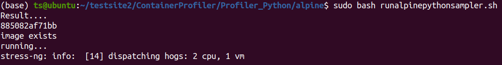

It will store the output in the specified directory.

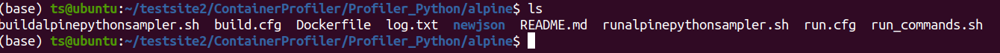

7) Finally, you can graph the results. First, make sure you have installed all the dependencies mentioned in the Graphing folder.
 Note that you must be a root privileges for the graphing scripts to work. 
 I specified the output directory to be newjson and to graph the results, 
 I need to go into the Graphing directory and provide the following command containing the appropriate path: 

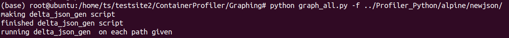

The generated graphs are stored in the `vm_container_images` folder of the Graphing directory.

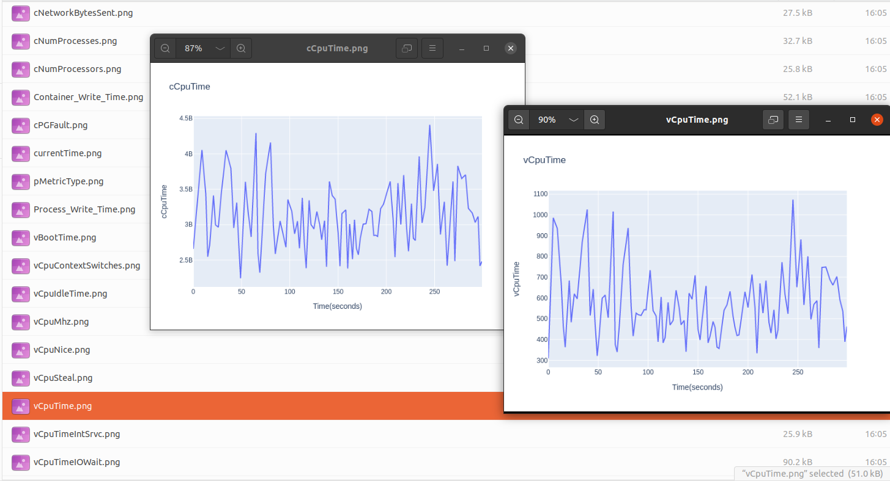


Metrics Description 
=======

The text below describes the metrics captured by the script **rudataall.sh** and **rudataall-psutil.py** for profiling resource utilization on the 
virtual machine (VM) level, container level and process level. A complete metrics description spreadsheet can be found at 
https://github.com/wlloyduw/ContainerProfiler/blob/master/metrics_description_for_rudataall.xlsx 

VM Level Metrics
----------------


| **Attribute** | **Description** |
| ------------- | --------------- |
| vCpuTime | Total CPU time (cpu_user+cpu_kernel) in centiseconds (cs) (hundreths of a second) |
| vCpuTimeUserMode | CPU time for processes executing in user mode in centiseconds (cs) |  
| vCpuTimeKernelMode | CPU time for processes executing in kernel mode in centiseconds (cs) |  
| vCpuIdleTime | CPU idle time in centiseconds (cs) |  
| vCpuTimeIOWait | CPU time waiting for I/O to complete in centiseconds (cs) |  
| vCpuTimeIntSrvc | CPU time servicing interrupts in centiseconds (cs) |  
| vCpuTimeSoftIntSrvc | CPU time servicing soft interrupts in centiseconds (cs) |  
| vCpuContextSwitches | The total number of context switches across all CPUs |  
| vCpuNice | Time spent with niced processes executing in user mode in centiseconds (cs) |  
| vCpuSteal | Time stolen by other operating systems running in a virtual environment in centiseconds (cs) |  
| vCpuType | The model name of the processor |  
| vCpuMhz | The precise speed in MHz for thee processor to the thousandths decimal place |  
| vDiskSectorReads | The number of disk sectors read, where a sector is typically 512 bytes, assumes /dev/sda1|  
| vDiskSectorWrites | The number of disk sectors written, where a sector is typically 512 bytes, assumes /dev/sda1 |  
| vDiskSuccessfulReads | Number of disk reads completed succesfully |
| vDiskMergedReads | Number of disk reads merged together (adjacent and merged for efficiency) |
| vDiskReadTime | Time spent reading from the disk in millisecond (ms) |
| vDiskSuccessfulReads | Number of disk reads completed succesfully |
| vDiskSuccessfulWrites | Number of disk writes completed succesfully |
| vDiskMergedWrites | Number of disk writes merged together (adjacent and merged for efficiency) |
| vDiskWriteTime | Time spent writing in milliseconds (ms) |
| vMemoryTotal | Total amount of usable RAM in kilobytes (KB) |
| vMemoryFree | The amount of physical RAM left unused by the system in kilobytes (KB) |
| vMemoryBuffers | The amount of temporary storage for raw disk blocks in kilobytes (KB) |
| vMemoryCached | The amount of physical RAM used as cache memory in kilobytes (KB) |
| vNetworkBytesRecvd | Network Bytes received assumes eth0 in bytes |
| vNetworkBytesSent | Network Bytes written assumes eth0 in bytes |
| vLoadAvg | The system load average as an average number of running plus waiting threads over the last minute |
| vPgFault | type of exception raised by computer hardware when a running program accesses a memory page that is not currently mapped by the memory management unit (MMU) into the virtual address space of a process|
| vMajorPageFault | Major page faults are expected when a prdocess starts or needs to read in additional data and in these cases do not indicate a problem condition |
| vId | VM ID (default is "unavailable") |
| currentTime | Number of seconds (s) that have elapsed since January 1, 1970 (midnight UTC/GMT) |


      
          
          
Container Level Metrics
----------------

| **Attribute** | **Description** |
| ------------- | --------------- |
| cCpuTime | Total CPU time consumed by all tasks in this cgroup (including tasks lower in the hierarchy) in nanoseconds (ns) |
| cProcessorStats | Self-defined parameter |
| cCpu${i}TIME | CPU time consumed on each CPU by all tasks in this cgroup (including tasks lower in the hierarchy) in nanoseconds (ns) |
| cNumProcessors | Number of CPU processors |
| cCpuTimeUserMode | CPU time consumed by tasks in user mode in this cgroup in centiseconds (cs) |
| cCpuTimeKernelMode | PU time consumed by tasks in kernel mode in this cgroup in centiseconds (cs) |
| cDiskSectorIO | Number of sectors transferred to or from specific devices by a cgroup (no longer collected for newer Linux kernels) |
| cDiskReadBytes | Number of bytes transferred from specific devices by a cgroup in bytes |
| cDiskWriteBytes | Number of bytes transferred to specific devices by a cgroup in bytes |
| cMemoryUsed | Total current memory usage by processes in the cgroup in bytes |
| cMemoryMaxUsed | Maximum memory used by processes in the cgroup in bytes |
| cNetworkBytesRecvd | The number of bytes each interface has received |
| cNetworkBytesSent | The number of bytes each interface has sent |
| cId | Container ID |


##

Process Level Metrics
----------------

| **Attribute** | **Description** |
| ------------- | --------------- |
| pId | Process ID |  
| pNumThreads | Number of threads in this process |  
| pCpuTimeUserMode | Total CPU time this process was scheduled in user mode, measured in clock ticks (divide by sysconf(\_SC_CLK_TCK)) |  
| pCpuTimeKernelMode | Total CPU time this process was scheduled in kernel mode, measured in clock ticks (divide by sysconf(\_SC_CLK_TCK)) |
| pChildrenUserMode | Total time children processes of the parent were scheduled in user mode, measured in clock ticks |
| pChildrenKernelMode | Total time children processes of the parent were scheduled in kernel mode, measured in clock ticks |
| pVoluntaryContextSwitches | Number of voluntary context switches | 
| pNonvoluntaryContextSwitches | Number of involuntary context switches | 
| pBlockIODelays | Aggregated block I/O delays, measured in clock ticks | 
| pVirtualMemoryBytes | Virtual memory size in bytes | 
| pResidentSetSize | Resident Set Size: number of pages the process has in real memory.  This is just the pages which count toward text, data, or stack space.  This does not include pages which have not been demand-loaded in, or which are swapped out | 
| pNumProcesses | Number of processes inside a container | 


# FAQ
## General

### Why should I use the Container Profiler?
Container Profiler is an easy to use profiling tool for profiling applications or workflows in a container.

## Usage

### How do I use the Container Profiler on my own container?

1. Clone the Container Profiler repository.

2. Pick one of the four version-environment pairs and enter its corresponding directory.

3. Edit the Dockerfile to install the required dependencies for creating your container and then alter build.cfg to provide your custom tag for the local built images. If you need to pull a pre-built vanilla version of the profiler image from docker hub, you can choose that in the build.cfg. You may alter run_commands.sh to pre-load the set of commands in your image if you will run the same set of commands on the image.

4. Execute the `bash build<environment><version>sampler.sh` command to build your custom image with tag provided tag in build.cfg.

5. Edit the run.cfg file to provide the runtime parameters. If you intend to use run_commands.sh file, provide `bash run_commands.sh` to the COMMAND variable.

6. Execute the `bash run<environment><version>sampler.sh` command to execute your container which will output the collected samples in the provided output directory.

7. You can then plot the samples by going into the *Graphing* directory and  following the instructions to use them.

## Miscellaneous
### How should I reference the Container Profiler if I use it?
Contact the BioDepot team for more information.
